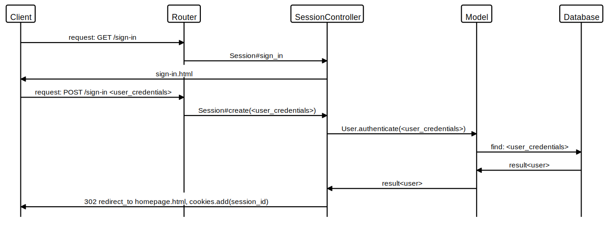
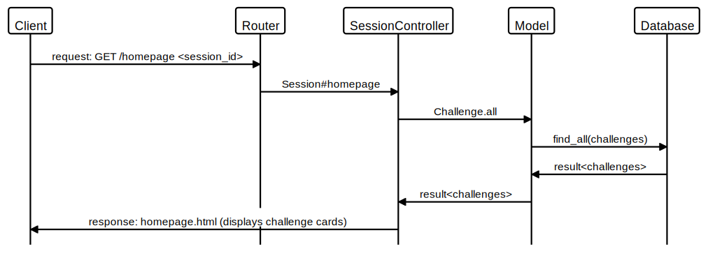
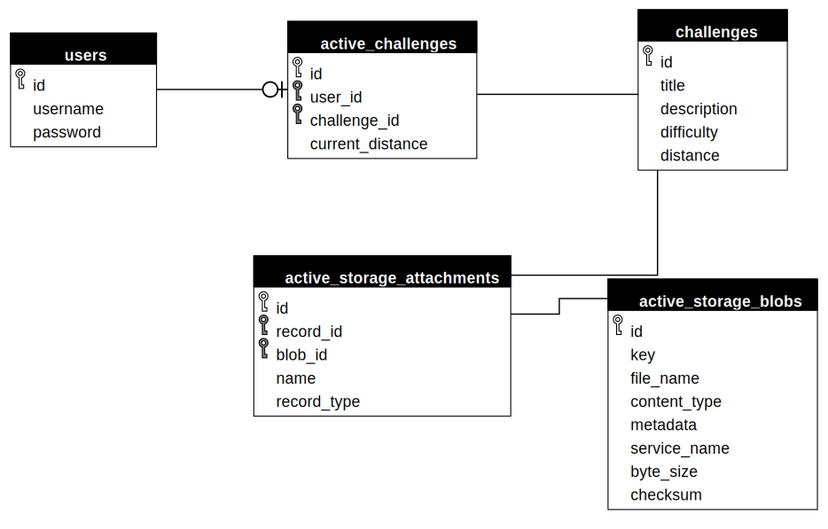

# Sprint App

A running challenge app

## MVP User Stories

### Sign up

```
As a user,
So that I can sign up,
I want a sign up button on the landing page.
```

```
As a user,
So that I can put in my details,
I want a username and password field on the sign up form.
```

```
As a user,
So I can make use of my new account,
I want to be redirected to the homepage once signed up,
And I will see a message confirming I am signed in.
```

### Sign in use

```
As a user,
So that I can sign in ,
I want a sign in button on the landing page.
```

```
As a user,
So that I can put in my details,
I want a username and password field on the sign in form.
```

```
As a user,
So I can make use of my account,
I want to be redirected to the homepage once signed in,
And I will see a message confirming I am signed in.
```

### Sign out use

```
As a user,
So that my account is secure,
I want a sign out button on the homepage.
```

```
As a user,
So I can see I am signed out,
I want to be redirected to the landing page,
And I will see a message confirming I am signed out.
```

### Home page

```
As a user,
When I have signed up / signed in,
So that I can see I am using my account,
I would like to see my username and an icon in the navbar.
```

```
As a user,
So that I know the website I am using,
I would like to see a title and a logo on the page header.
```

```
As a user,
So that I can navigate the webiste,
I would like a navbar on the home page.
```

```
As a user,
When I am yet to join a challenge,
So that I can view available challenges,
I would like to see a list of the available challenges and click on the challenge to view more details.
```

```
As a user,
When I have joined a challenge,
So that I can see my challenge progress,
I would like to see the distance target, current distance, and how much distance I have left to cover.
```

```
As a user,
When I have joined a challenge,
So that I can submit my run,
I would like to see an 'Add distance' button.
```

### Specific challenge page

```
As a user,
So that I can see the challenge details,
I would like to see a description of the challenge. (title,difficulty,distance,icon)
```

```
As a user,
So that I can choose a challenge,
I would like a join button on the challenge page.
```

```
As a user,
When I click the 'join challenge' button,
So that I can see my current challenge progress,
I would like to be redirected to the home page.
```

### Add distance page

```
As a user,
So that I can track my progress,
I would like a form to submit my distance.
```

```
As a user,
When I submit my distance,
So that I can see my progress,
I would like to be redirected to the home page,
And see my challenge stats have been updated.
```

### Challenge completed page

```
As a user,
When I submit my distance,
And when I have reached my target,
So that I celabrate reaching the target,
I would like to be redirected to the challenge completed page.
```

```
As a user,
So that I can see what I have achieved,
I would like to see a challenge badge for my completed target.
```

```
As a user,
So I can get started on my next challenege,
I would like to see a select my next challenge button,
And this will redirect me to the home page.
```

## Sign in sequence



## Homepage challenge link sequence



## Challenge entity relationship


